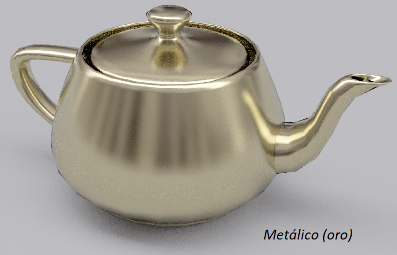
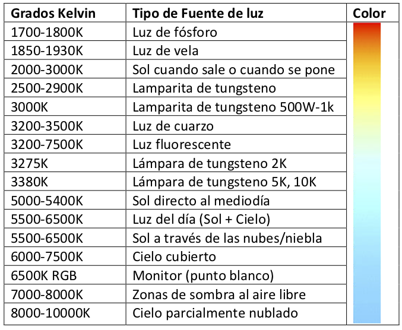

# Proyecto 2 - _Una Escena más realista. Iluminación. Distintos materiales_

En este proyecto deberán generar dos escenas diferentes. Éstas deben estar constituidas por:

- __Escena A__. Debe organizarse sobre un plano. Sobre este plano deben ubicarse 24 esferas de al menos tres materiales diferentes (en un arreglo de 6x4). Los materiales básicos deben tener una apariencia rugosa opaca (como, por ejemplo, la de cerámica de barro sin recubrimientos), satinada (como se mostró en los adornos de Navidad en clase) y metálica (como, por ejemplo, oro o cobre que se detalla en la figura que se muestra a continuación). En esta escena deben integrarse luces puntuales, direccionales y spots. Debe haber por lo menos una de cada una. 

  

- __Escena B__. En esta escena se deben integrar, como mínimo, tres objetos con tres apariencias diferentes (dos, al menos, deben ser las desarrolladas para la escena A). La escena debe estar coherentemente integrada. Deben integrar las luces que consideren convenientes.

En lo que respecta a la interacción con la escena deberán permitir que:

- En ambas escenas se deben poder variar los parámetros de las luces que consideren conveniente.
- En la escena B también deben poder variarse los parámetros del material que consideren adecuados.

Son interesantes los modelos desarrollados por Disney. Estos se detallan, por ejemplo, en s2012_pbs_disney_brdf_notes_v3.pdf y s2015_pbs_disney_bsdf_notes.pdf.

## 1. Objetivo

En este trabajo se familiarizarán con el proceso de renderizado de escenas con métodos de iluminación local. Considerarán distintos modelos de fuentes de luz y distintos materiales. La generación de distintos materiales se basa en la observación de objetos de distintos materiales reales o de imágenes de los mismos, y la reproducción de estos materiales considerando los métodos de reflexión vistos. Este es un paso más hacia la creación de la escena del proyecto integrador.

## 2. Los Modelos

Pueden usar los modelos de luces vistos en clase y también pueden incorporar modelos que consideren convenientes (por ejemplo, luces de área). En cuanto al color de la luz, si bien puede modelarla con un color arbitrario, en la escena A deben considerar luces que se asemejen a alguna de las detalladas en la tabla que se muestra a continuación:

  

En lo que respecta a los materiales puede utilizar los desarrollados en clase y diseñar BRDFs considerando los términos difuso y especular que considere más convenientes en cada caso. También puede incorporar algún material incorporándolo desde un archivo donde se almacena una BRDF adquirida.
Es altamente recomendable que el modelo de iluminación sea físicamente plausible.

## 3. Extras

Se detallan algunas sugerencias para superar lo mínimo necesario para completar este Proyecto. ¡Sólo intenten hacer esto una vez que hayan cumplido con los requerimientos mínimos para el proyecto!

- Incorporación de material/es desde un archivo donde se almacena una BRDF adquirida.
- Modelado de materiales con incorporación de scattering a nivel de sub-superficie. Puede usar como referencia el trabajo _Arbitrarily Layered Micro-Facet Surfaces_, Andrea Weidlich y Alexander Wilkie; también puede usar el trabajo s2015_pbs_disney_bsdf_notes.pdf.
- Modelado de materiales (que exhiban transmisión difusa y/o especular) con BSDF mediante el modelo de Disney. Éste puede encontrarlo en s2015_pbs_disney_bsdf_notes.pdf (ver figuras 5 y 6).
- Modelado de materiales perlados (se mostró en clase un adorno de Navidad de este tipo)

## 4. Calificación

El Proyecto será calificado de acuerdo a las rúbricas proporcionadas en la sub-sección 4.2. Se presentan rúbricas para la evaluación de:

- Aspectos cognitivos
- Presentación
- Exposición oral

Para aprobar el proyecto ninguno de los ítems evaluados debe ser insuficiente. La nota se integrará considerando todos los requerimientos exigidos.

### 4.1 Materiales calificados

Los modelos proporcionados o creados por la cátedra para la explicación de los temas no contarán para este requisito.

En lo que respecta a la escena B, cualquier modelo que se encuentre en la Web o que ustedes mismos creen o generen debe ser más complejo que una simple primitiva geométrica (por ejemplo, esfera, cubo, plano, cónica, etc.) o una combinación trivial de múltiples primitivas geométricas (por ejemplo, dos esferas apiladas una encima de la otra). Los materiales desarrollados para estos objetos deben ser físicamente plausibles. Si estos requisitos no están del todo claros, pregunten a los auxiliares de la cátedra para que le proporcione orientación.

### 4.2 Rúbricas

Disponibles en la version PDF de esta consigna accesible via [Moodle](https://moodle.uns.edu.ar/moodle).

